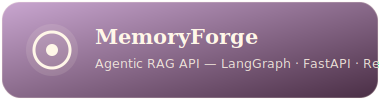
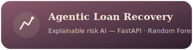

<p align="center">
  
</p>

# Divya Tripathi — Portfolio

I like systems that think before they act. Somewhere between a FastAPI route and a LangGraph node, I found the kind of problem I actually want to spend my career on: making software reason, retrieve, and decide — not just respond.

This is my personal site: part portfolio, part proof-of-work, built on a cinematic template and rewired to actually be mine.

**Live:** [https://divya-tripathi-portfolio-five.vercel.app/] **GitHub:** [divyat2605/cinematic-portfolio](https://github.com/divyat2605/divya-tripathi-portfolio)


## About Me

I'm a final year B.Tech CS student at SRM Institute of Science and Technology, Delhi NCR, graduating in 2027. I spend most of my time in the space where agentic AI systems meet real backend engineering — RAG pipelines that need to actually retrieve the right thing, agents that need to actually stop when they should, and APIs that need to hold up under more than a demo's worth of traffic.

My toolkit leans heavily on **FastAPI, PostgreSQL, LangChain/LangGraph, Redis, and Docker** — the boring-but-essential layer that makes "AI-native" products behave like production software instead of a notebook that got lucky. I've picked up this stack across internships at **Vizh AI Solutions, DTU, and QuickGhy**, and sharpened the fundamentals with **200+ LeetCode problems** (mostly in C++). I'm also a **SAP Certified Associate – SAP Generative AI Developer**.

## Things I've Built

<p>
  
</p>

An agentic RAG API with LangGraph, FastAPI, Redis, and Qdrant, built around the idea that retrieval should have memory, not just embeddings.

<p>
  
</p>

An explainable AI system for loan recovery risk, using FastAPI, Random Forest, SHAP, and Streamlit, because a risk score nobody can explain isn't a risk score anyone should trust.

Details, links, and write-ups for all of these live on the site itself.


## Stack (of the site, not the résumé)

| Layer      | Technology                                       |
| ---------- | ------------------------------------------------ |
| Framework  | Next.js 16.2 (App Router, React Compiler)        |
| Animations | GSAP 3 + Three.js                                |
| Styling    | CSS Modules + Tailwind v4 (tokens only)          |
| Icons      | react-icons                                      |
| Fonts      | Geist, Baloo 2, Dancing Script (via next/font)   |

## Getting Started

```bash
git clone https://github.com/divyat2605/divya-tripathi-portfolio.git
cd cinematic-portfolio
npm install
npm run dev
```

Open [http://localhost:3000](http://localhost:3000).

To build for production:

```bash
npm run build
npm start
```

## Under the Hood

If you're poking around the codebase, here's what actually drives the site:

- **`data/profile.json`** — the source of truth for everything about me: name, tagline, bio, the roles and stats shown in the hero, my work history at Vizh AI Solutions, DTU, and QuickGhy, the project cards for MemoryForge and the Loan Recovery System, and links out to GitHub, LinkedIn, and everywhere else I exist online.
- **`data/content.json`** — the site's own voice: section taglines, CTA copy, footer phrases. Not personal data, just the words holding the layout together.
- **`app/globals.css`** — the visual identity. The `:root` tokens (`--accent`, `--hero-start`, `--hero-mid`, `--hero-end`, `--text-primary`) control the gradients and colors you see across the hero and footer.
- **`lib/siteConfig.js`** — the canonical site URL, used for metadata and SEO.
- **`public/assets/`** — the portrait, intro video, and background media that make the "cinematic" part of cinematic-portfolio actually true.

## Deployment

Connect the repository to [Vercel](https://vercel.com) and it deploys automatically with zero configuration.

Alternatively:

```bash
npm i -g vercel
vercel
```

## License

MIT. 


## Reach Me

**Divya Tripathi** — AI/ML Engineer & Backend Developer

[GitHub](https://github.com/divyat2605) &nbsp;|&nbsp; [divya.tripathi.official2605@gmail.com](mailto:divya.tripathi.official2605@gmail.com)